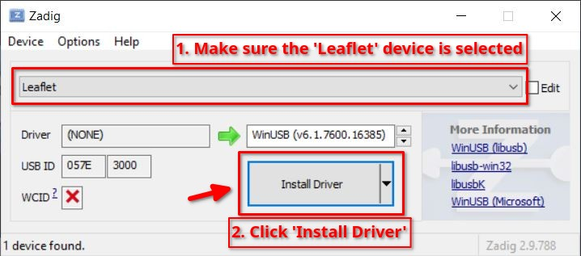
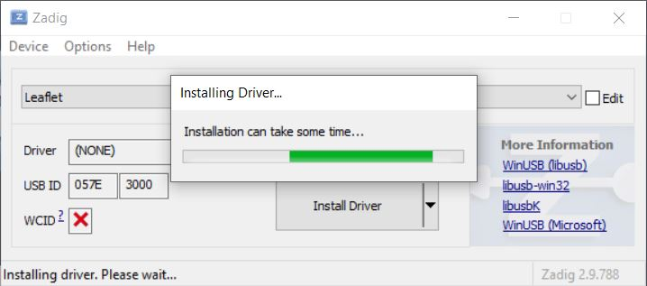
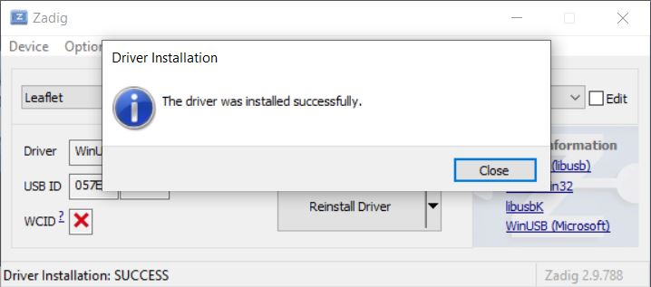
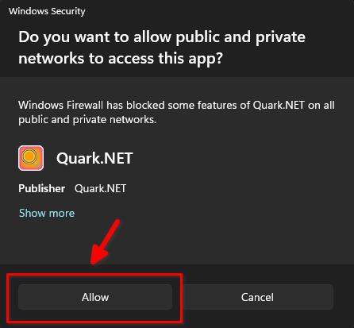

<p align="center">
  
</p>

# Quark.NET

**Quark.NET** is a self-contained .NET/Avalonia based "rewrite" of the original [Java-based Quark by XorTroll](https://github.com/XorTroll/Goldleaf). Quark.NET is Leaflet's USB and network host client/dedicated server software.

It replaces the original Java stack with a single-file executable requiring no .NET runtime installation.

## Downloading Quark

You can download the latest release of Quark for your operating system from the [releases](https://github.com/DefenderOfHyrule/Quark.NET/releases/latest) page, refer to the table below for the platform-specific release naming scheme.

| Platform            | Release name           |
|---------------------|------------------------|
| Windows x64         | `Quark-win-x64.exe`    |
| Windows arm64       | `Quark-win-arm64.exe`  |
| Linux x64           | `Quark-linux-x64`      |
| Linux arm64         | `Quark-linux-arm64`    |
| macOS (x64, arm64)  | `Quark-osx.zip`        |

## Using Quark

Follow the [Platform-specific setup](#platform-specific-setup) below for your operating system. Once done, follow the instructions below:

1. Launch Quark.
1. Add the folder(s) containing your game dumps in the **Content Paths** panel of Quark so the Switch can browse these folders on your PC later.
1. Launch [Leaflet](https://github.com/DefenderOfHyrule/Leaflet) on your Switch.
1. Navigate to `Install from Quark` from Leaflet's main menu and select `USB` or `Wireless (LAN)`, depending on which method you want to use to browse content on your PC.

> [!NOTE]
> Please make sure you've plugged in your Switch *before* pressing `USB`, and make sure you add a new host with your PC's IP address (displayed in Quark) if you want to connect to Quark wirelessly.

## Platform-specific setup

### Windows (x64 & arm64)

For Windows, you will need to install the libusbK driver for USB functionality to work. To do this, follow the instructions below:

1. Plug your Switch (running Leaflet) into your PC via USB,
1. Open `Quark-win-x64.exe` or `Quark-win-arm64.exe` (depending on your computer's architecture),
    > If you get a SmartScreen popup, click `More info` and click `Run anyway`. This popup happens because the app is unsigned.
1. Click the red `Install Driver` button near the top of the Quark window,
    > **Note:** The arm64 build of Quark.NET will *NOT* have this button. The arm64 build requires you to install the WinUSB driver using Zadig in the manual instructions below.
1. Press `Yes` on the UAC (admin) prompt that appears.

Once you've done this, you can continue with [Using Quark](#using-quark).

> [!NOTE]
> **Manual alternative:** if you'd rather install the driver yourself, download the latest release of [Zadig](https://zadig.akeo.ie/) and follow the screenshots below instead of using the in-app button. Either WinUSB or libusbK will work if you go this route, just make sure to select one of them (not the serial/CDC option) for the Leaflet device.
>
> 
>
> **Note:** If the Leaflet device does not show up here automatically, you may have to navigate to `Options` at the top and then make sure `List All Devices` is selected.
>
> 
> 

> [!NOTE]
> **Allowing Quark through the Windows Defender firewall**
>
> **Network:** Regarding network functionality, you will just need to allow Quark through Windows Defender firewall when Windows prompts you to either allow or deny Quark from having network access when you run Quark for the first time.
>
> 

### Linux (x64 & arm64)

For Linux,

1. Plug your Switch (running Leaflet) into your PC via USB,
1. Open `Quark-linux-(architecture)`,
    > You'll need to make the executable executable if your file manager doesn't allow you to run the executable from your file manager directly. To do this, follow the instructions below:
    > 1. Open a terminal window,
    > 1. Enter the following command: `chmod +x /path/to/Quark-linux-(architecture)` (replacing /path/to with the actual path to the executable).
    > 1. You should now be able to double click the app to open it from your file manager.
    > 1. **Note:** most file managers *do* allow you to make a file executable by right clicking the file and going to `Properties` > `Permissions` (or similar) > `Allow executing file as program`. The process is roughly the same for all Linux distributions.
1. Click the red `Setup udev` button near the top of the Quark window,
1. Fill in your root password in the dialogue box that appears,
1. Click `Install`,
1. Unplug and replug your Switch to pick up the new rule.

Once you've done this, you can continue with [Using Quark](#using-quark). If relevant, you may also need the firewall rule below.

> [!NOTE]
> **Manual alternative:** if you'd rather set up the udev rule yourself instead of using the in-app button, enter the following command in a terminal window:
>
> ```
> echo 'SUBSYSTEM=="usb", ATTR{idVendor}=="057e", ATTR{idProduct}=="3000", MODE="0666"' | sudo tee /etc/udev/rules.d/51-quark.rules
> ```
>
> Then reload udev:
>
> ```
> sudo udevadm control --reload-rules && sudo udevadm trigger
> ```

> [!NOTE]
> **Setting up the firewall rule to allow network access**
>
> **Network:** Some distributions (notably EndeavourOS) require port 2313 to be open in the firewall. With firewalld this is done by running the following commands:
>
> ```
> sudo firewall-cmd --add-port=2313/tcp --permanent
> sudo firewall-cmd --reload
> ```
>
> If you use UFW, you'd run the following commands:
>
> ```
> sudo ufw allow 2313/tcp
> sudo ufw reload
> ```
>
> Do note that Fedora and Ubuntu-based distributions typically do not require this.

### macOS (x64 & arm64)

For macOS,

1. Plug your Switch (running Leaflet) into your mac via USB,
1. Extract the `Quark-osx.zip` archive somewhere,
1. Open `Quark.app` from Finder.

Once you've done this, you can continue with [Using Quark](#using-quark).

Regarding network functionality, you typically do not need to change anything.

## Building from source

Requires .NET 10, run the command below in a terminal window from the root of the repository:
```bash
./build-releases.sh
```

Releases will be written to the `releases` folder in the root of the repository.

> [!NOTE]
> Building the Windows release rebuilds `quark-wdi.dll` (the embedded libusbK driver installer) via `build_wdi.sh`, which needs the libusbK SDK and must be run from an MSYS2 MinGW terminal.

## Config file

Special paths are stored as JSON at:

| Platform    | Path                                 |
|-------------|--------------------------------------|
| Linux/macOS | `~/.config/quark/quark-config.json`  |
| Windows     | `%APPDATA%\quark\quark-config.json`  |

## Protocol

Quark.NET implements the GLCI/GLCO 4 KB block protocol:
- **USB**: VID `0x057E` / PID `0x3000`, bulk EP `0x01` (out) / EP `0x81` (in)
- **TCP**: port `2313`, same command framing

All 17 command IDs supported (drive listing, stat, file read/write, special paths, file picker).
